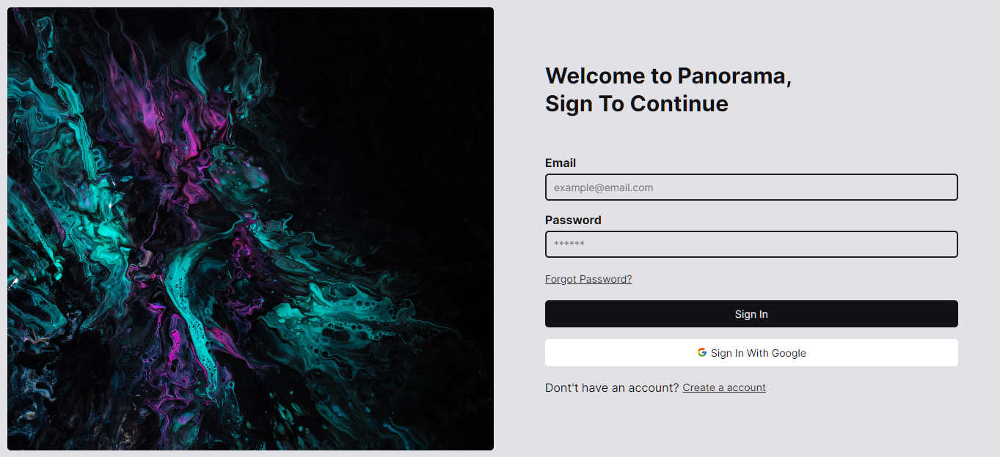
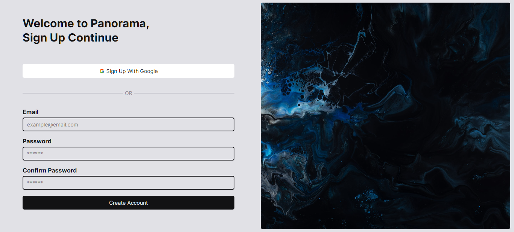
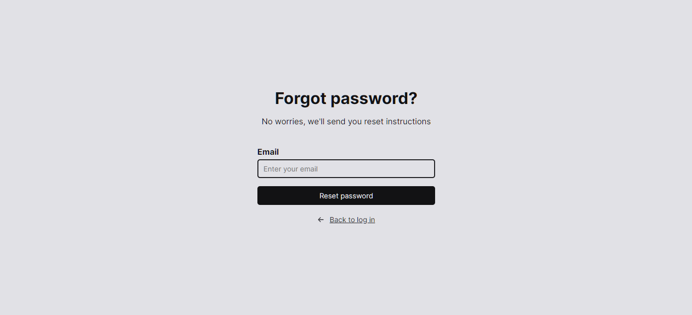
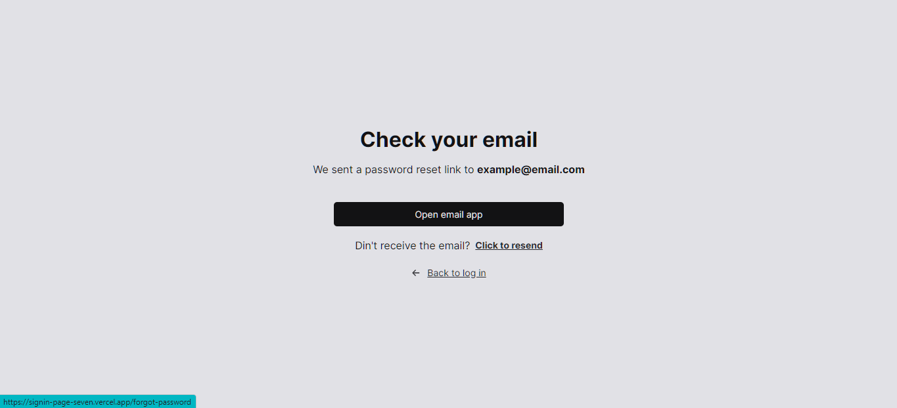
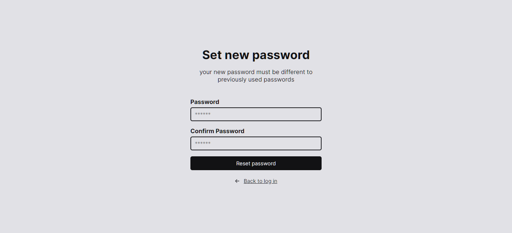
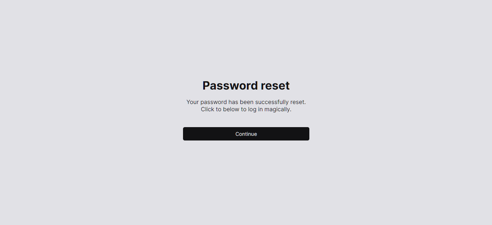

## **Panorama | All your photos in one place**

---

Este é um projeto criado utilizando o Vite para criar uma página de signin, cadastro e recuperação de senha para uma aplicação qualquer. Este projeto tem foco no design e apresentação das informações, sem a implementação de funcionalidades.

Veja o site neste link: [**Panorama | All your photos in one place**](https://signin-page-seven.vercel.app/)

## Funcionalidades

Este projeto não possui funcionalidades implementadas. Ele é apenas um protótipo visual das páginas de signin, cadastro e recuperação de senha.

## Tecnologias Utilizadas

- Vite
- React
- TypeScript
- Styled-Components

## Instalação e Execução

1 - Clone este repositório:

```bash
  git clone https://github.com/hugomos/signin-page.git
```

2 - Instale as dependências usando npm ou yarn:

```bash
  yarn install
```

3 - Inicie o servidor usando npm run dev

```bash
  yarn dev
```

4 - Para acessar as paginas em ambiente de desenvolvimento:

- Signin em **http://localhost:5173/**
- SignUp em **http://localhost:5173/create-account**
- Recuperação de senha em **http://localhost:5173/forgot-password**

## Telas

### **SignIn**



### **SignUp**



### **Forgot Password**



### **Email Verification**



### **Set New Password**



### **Password Reset**



### Published with [**Vercel**](https://vercel.com/dashboard)
